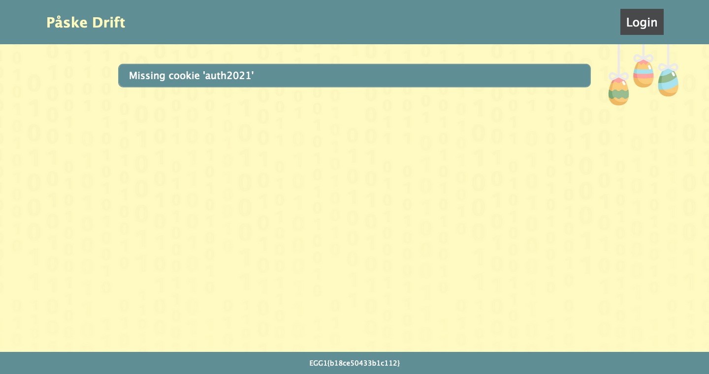

# Egg 0
We start at https://påske.itemize.no/, here we get the first egg for free at the bottom of the page.


# Egg 1
At the `/login` page we are asked to bypass the login, with some trail and error you could solve this with some simple SQL injection, username: `' or 1=1 --`, password: `<anything...>`. 

## How it works:
You can find the source here:
https://github.com/kristianvld/paske-2021/blob/main/app.js#L90-L101

Basically it does a simple SQL lookup on the username and password. With inserting our username and password you get the following query:
```sql
SELECT id FROM users WHERE username='' or 1=1 --' AND password='<anything...>'
```
So we can see that we check if username is empty **or 1=1**, which is always true and will return all users in the DB. We also comment out the rest of the line with the two dashes.

We are then redirected to `/panel` and get egg 1:


# Egg 2:
We see here that we are missing an `auth2021`cookie, but after logging in we see we got an `auth2020` cookie, using any cookie editor to rename the cookie or just change it in the inspector takes us to the panel page. In the screenshot below shows the renamed cookie in [Cookie Editor](https://cookie-editor.cgagnier.ca/), available for most browsers:

_When using Cookie Editor, remember to click the save icon after editing._

Refreshing the page takes us to the proper panel and shows egg 2:


# Egg 3:
We are then asked to find the __city name__ and __number of eggs__ delivered to this city.

There isn't much to go by, but we can notice the two recently used files which links to: \
https://xn--pske-qoa.itemize.no/haredata/egg-produksjon.png \
https://xn--pske-qoa.itemize.no/haredata/egg-jakt-vinnere-2020.png

Both of the links just link to some images, but we can notice that both are located in the `/haredata/` folder. Navigating to just this folder (so https://xn--pske-qoa.itemize.no/haredata/) lists the full content of the folder with directory listing:


Here we can see the `flagg3` file which contains egg 3.

# Egg 4:
In the folder we notice there are a couple of `.aes256cbc` files. We can download all of these, running `file` on these shows:
```bash
file flagg4.aes256cbc

flagg4.aes256cbc: openssl enc'd data with salted password
```
So these are OpenSSL encrypted files with AES-256 in CBC mode. We can also notice the `it-sikkerhets-guide-for-fillagring.md` file which describes how files on disk should be encrypted and decrypted. One can simply copy-paste the commands here and use the password in the file to decrypt the files. E.g.:

```bash
openssl aes-256-cbc -md sha512 -in flagg4.aes256cbc -out flagg4 -d
<...type the password 'PåskeDrift Passord!' without quotes...>

cat flagg4
EGG4{58f42a65a52cfc26}
```

# Egg 5
Using the same decryption method from egg 4, we can decrypt the two files `by_id.csv` and `egg_by.csv`. Here alot of people got stuck, not figuring out how to combine these properly.

We see that `by_id.csv` is just a map between city name and city id. Notice however that one city name can map to several city IDs!
```bash
head by_id.csv

By,By-ID
Kirkenes,0
Stavanger,1
Lillehammer,2
Lillehammer,3
Raufoss,4
Åndalsnes,5
Sauda,6
Sarpsborg,7
Skien,8
```
_Notice id `2` and `3` both map to `Lillehammer`._

If we then look at the `egg_by.csv` this contains a mapping between how many eggs were delivered to a given city id.

So say we wanted to look at how many eggs were delivered to `Lillehammer` we would first need to get all the ids mapping it:

```bash
grep Lillehammer by_id.csv

Lillehammer,2
Lillehammer,3
Lillehammer,133
```

Then we can lookup all eggs delivered to these ids in the `egg_by.csv` file:

```bash
grep -E ',2,|,3,|,133,' egg_by.csv

658,2,Max
467,2,CoCo
424,3,Max
```
_The `-E` flag turns on extended regex in `grep` meaning that `|` here means or, so searching for lines containing `,2,` or `,3,` or `,133,`. We add the commas before and after as the city id is the second column in the csv file._

So one thing to notice here is that:
1. A single city id can have multiple deliveries of eggs
2. Not all city ids get egg deliveries

So from the output above we can see that `Lillehammer` got a total of `1549` eggs. Then we just need to automate this to lookup all eggs for all cities and determin which city got the most and how many. An example solve script in python can be found at [../orig-csv-data/solve.py](../orig-csv-data/solve.py).

We should then find that `Kristiansund` got the most eggs of any city with `2652`.

Entering this into the form on the panel page takes us to a new panel at `/panel?token=161e3db7b94020a9`:


# Egg 6:
So here we are tasked with simply submitting the `Register utsending` form.

We can see that we need to set `Send ut påskeegg:` to `Ja`, but we can not click on this field. Inspecting the HTML, we can just remove the `disabled` tag and then it becomes editable:

If we then try to submit, we get wrong password in a popup. Looking more at the source, we can see that this is the main source:
```html
<form onsubmit="sendForm(); return false" action="/panel?token=161e3db7b94020a9" method="POST" class="card">
	<h3>Send ut påskeegg:</h3>
	
	<label for="bekreft">Send ut påskeegg:</label>
	<select name="bekreft" id="bekreft" disabled>
		<option value="nei" selected>Nei</option>
		<option value="ja">Ja</option>
	</select>
	<label for="passord">Passord:</label>
	<input type="password" name="passord" id="passord">
	<input type="submit" value="Registrer utsending">
</form>

<script>
	function sendForm() {
		const form = document.forms[0];
		let bekreft = form.querySelector('#bekreft').value;
		let passord = form.querySelector('#passord').value;

		bekreft = bekreft == 'ja';
		if (!bekreft) {
			alert('neivel da');
			return;
		}
		try {
			checkPass(passord, 1);
		} catch (err) {
			console.error(err);
		}
	}
	function checkPass(pass, form) {
		if (pass == 'qwerty') {
			document.forms[form].submit();
		} else {
			alert('feil passord');
		}
	}
</script>
```

So we can see that when we submit instead of submitting to `/panel?token=161e3db7b94020a9` the function `sendForm()` is called instead. This function checks that we have set confirmed to `ja` and also our password equals `qwerty`. We can then try to just submit that, but nothing happens??

If we look at the console log in the browser we can see that we got an error message every time we click submit:

The error says:
```
document.forms[form] is undefined panel:63:1
```
So we see that the error is caused in the third row of the `checkPass` function. We can also see that this function is called with `checkPass(passord, 1);`, so it will use the index `1`, but from further up in the code we can see that we should be using index `0`, so this just seems like a silly little bug on the form page. We can just manually call the function like:
```javascript
checkPass('qwerty', 0);
```
And that will correctly submit the form. We are then redirected to `/panel?token=161e3db7b94020a9` which displays the final egg 6!

It is also worth noting that you could just have sent the form manually, edited the request in burp or fixed the source directly, all would work in sending the correct form to the server and give you the url for the final flag. E.g. example `cURL` command:
```bash
curl 'https://xn--pske-qoa.itemize.no/panel?token=161e3db7b94020a9' -d 'bekreft=ja&passord=qwerty'
```